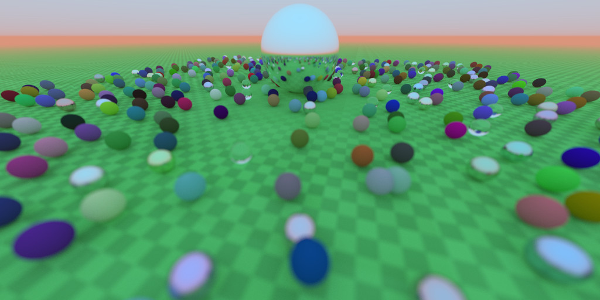

# Multi-Threaded Ray Tracer and Volumetric Ray Marcher

This is a personal project based on the "Ray Tracing in One Weekend" series (https://raytracing.github.io/). I expanded on the series to add multi-threading, ray marched volumetrics, and to show the image iterations over time.

## Renders:

## Features:
* Multi-threaded CPU rendering
* Volumetric ice using ray marching
* Infinite 3D perlin noise generator using modified PCG-3D and xxHash32 algorithms
* Bounding Volume Hierarchy (BVH) using AABBs
* Depth of field
* Motion blur
* Lambert, metal, dielectric, and ice material types
* Exponential fog
* Output displayed using DirectX 11 window
* Results accumulate over time so you can watch the quality increase as iterations are calculated

## Realtime display using tiles:
One major goal was to show the final image being calculated over time. To do that, I used multiple threads (hardware concurrency minus one) and had each thread process a 16x16 tile each frame. At the end of each frame, the updated image is applied to the frame buffer through a full screen pass.

I chose 16x16 tiles, so as to make it easier to port it to compute shaders later on.

As more rays are processed for each pixel, the image data is updated so it reflects the average of all ray colors so far. The result is that the image looks grainy at first, and slowly becomes clearer over time.

## Ice ray marching:

To get the cracks, I used 3D difference noise, which uses two noise samples to create what looks roughly like cracks or lightning.

I used ShaderToy as a way of quickly iterating on the formula, and created a small project here: https://www.shadertoy.com/view/fsyBRV

Once a ray hits ice, the material executes the ray marching.

## G-Buffer: (in a ray tracer!)
Immediately after adding ray marching, processing time went through the roof. However, I noticed that the ice needed far fewer iterations to look good than the ray traced spheres.

To mitigate this, I replaced the image buffer with a G-Buffer class containing separate buffers for the final image and ice volumetrics. The ice volumetrics are calculated for a set number of passes (20 right now), and are then sampled during the final image calculation.

This works great for rays that have not bounced yet, but what about rays that bounce off spheres and enter the ice from a different direction or at an off-screen point? For those, I run the ray marching again, using lower quality settings. As you can see from the reflections on the spheres, the reduced quality is not very noticeable.

## 3D Perlin noise:
The goal here was to have 3D noise with no repetition for any X, Y, and Z positions greater than (-1000000, -1000000, -1000000). I first tried using a cache of random numbers, but found it tricky to avoid repetition while getting enough detail.

So instead, I looked to 3D hash functions for creating random noise. https://www.shadertoy.com/view/XlGcRh was very useful for visualizing them, and the paper at https://www.shadertoy.com/view/XlGcRh provided evaluation of quality vs. speed for each method.

I ended up making a setting for choosing PCG3D (best quality) or xxHash32 (better balance of quality and speed).

## References:
1. Peter Shirley. 2020. _"Ray Tracing in One Weekend"_. (2020). https://raytracing.github.io/books/RayTracingInOneWeekend.html
2. Peter Shirley. 2020. _"Ray Tracing: The Next Week"_. (2020). https://raytracing.github.io/books/RayTracingTheNextWeek.html
3. Mark Jarzynski and Marc Olano. 2020. _"Hash Functions for GPU Rendering, Journal of Computer Graphics Techniques (JCGT), vol. 9, no. 3, 21-38"_. (2020). https://www.jcgt.org/published/0009/03/02/
