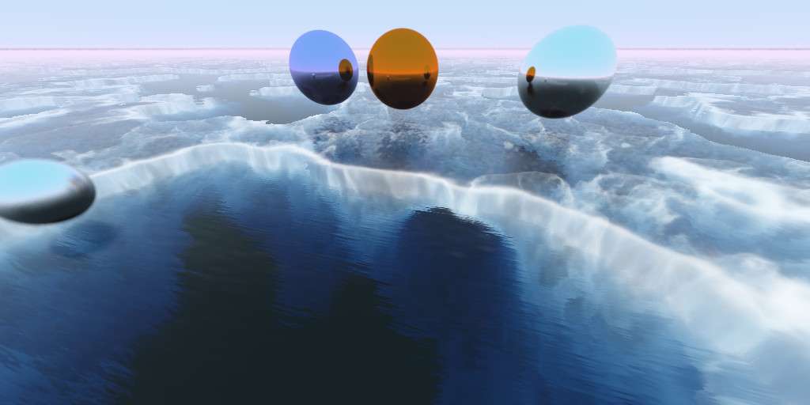
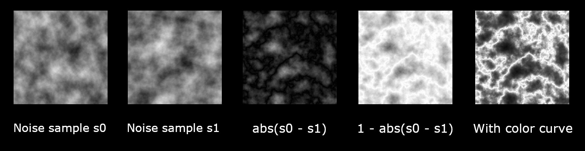

# Multi-Threaded Ray Tracer and Ray Marcher

This is a personal project based on the "Ray Tracing in One Weekend" series (https://raytracing.github.io/).

## Features:
* Multi-threaded approach using tiles
* Volumetric ice using ray marching
* Infinite 3D perlin noise generator using modified PCG-3D algorithm
* Bounding Volume Hierarchy (BVH) using AABBs
* Depth of field
* Motion blur
* Lambert, metal, and dielectric material types
* Output displayed using DirectX 11 window
* Results accumulate over time so you can watch the quality increase with more iterations

## Realtime display using tiles:
One major goal was to show the final image as it was being calculated over time. To do that, I use multiple threads (hardware concurrency minus one) and have each thread process a 16x16 tile each frame. At the end of each frame, the updated image is applied to the frame buffer through a full screen pass.

I chose 16x16 tiles, as this should make it easier to make a version that uses compute shaders later on.

As more rays are processed for each pixel, the image data is updated so it reflects the average of all ray colors so far. The result is that the image looks grainy at first, and slowly becomes clearer over time.

## Ice ray marching:

To get the cracks, I used 3D difference noise, which uses two noise samples to create what looks roughly like cracks or lightning.

I used ShaderToy as a way of quickly iterating on the formula, and created a small project here: https://www.shadertoy.com/view/fsyBRV

Once a ray hits ice, the material executes the ray marching.

## G-Buffer: (in a ray tracer!)
Immediately after adding ray marching, processing time went through the roof. However, I noticed that the ice needed far fewer iterations to look good than the ray traced spheres.

To mitigate this, I replaced the image buffer with a GBuffer class containing separate buffers for the final image and ice volumetrics. The ice volumetrics are calculated for a set number of passes (20 right now), and are then sampled during the final image calculation.

When a ray hits ice, if it has not bounced yet, it samples from the GBuffer instead of executing the expensive ray marching. If the ray has bounced before, it instead runs the ray marching with much lower quality settings.

This looks convincing enough, and drastically reduced the render time.

## 3D Perlin noise:
The goal here was to have 3D noise with no repetition for any X, Y, and Z positions greater than (-1000000, -1000000, -1000000). I first tried using a cache of random numbers, but found it tricky to avoid repetition.

So instead, I looked to 3D hash functions for creating random noise. https://www.shadertoy.com/view/XlGcRh was very useful for visualizing them, and the paper at https://www.shadertoy.com/view/XlGcRh provided evaluation of quality vs. speed for each method.

I ended up making a setting for choosing PCG3D (best quality) or xxhash32 (better balance of quality and speed).

## References:
* https://raytracing.github.io/books/RayTracingInOneWeekend.html
* https://raytracing.github.io/books/RayTracingTheNextWeek.html
* Noise formulas from: https://www.shadertoy.com/view/XlGcRh
* Noise evaluation: https://www.jcgt.org/published/0009/03/02/
